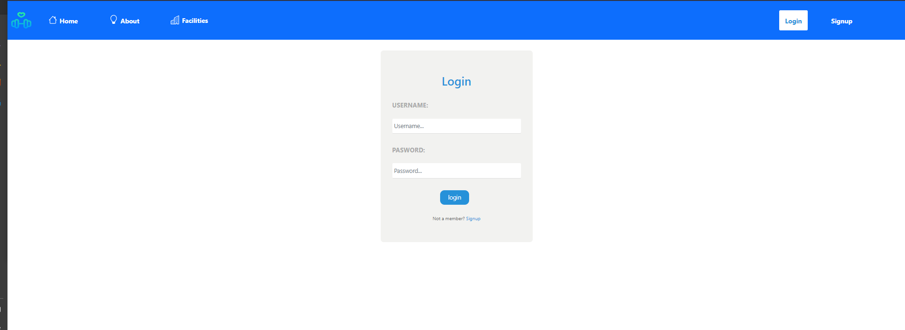
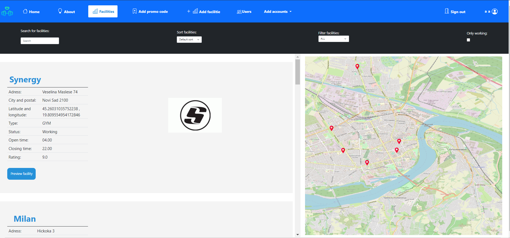
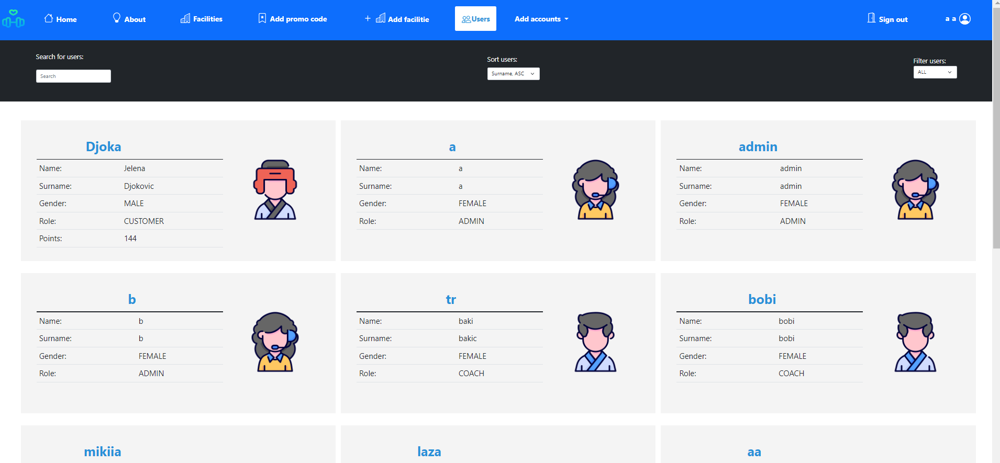
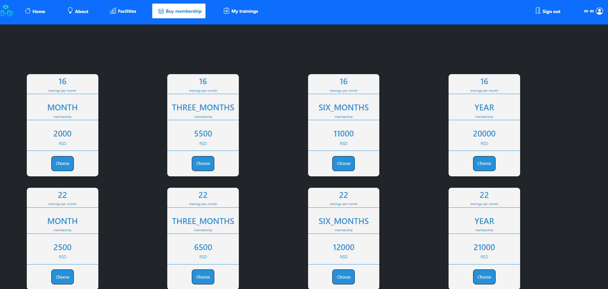
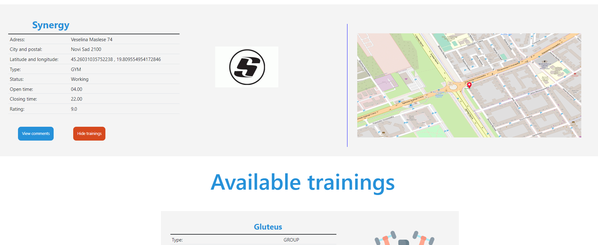
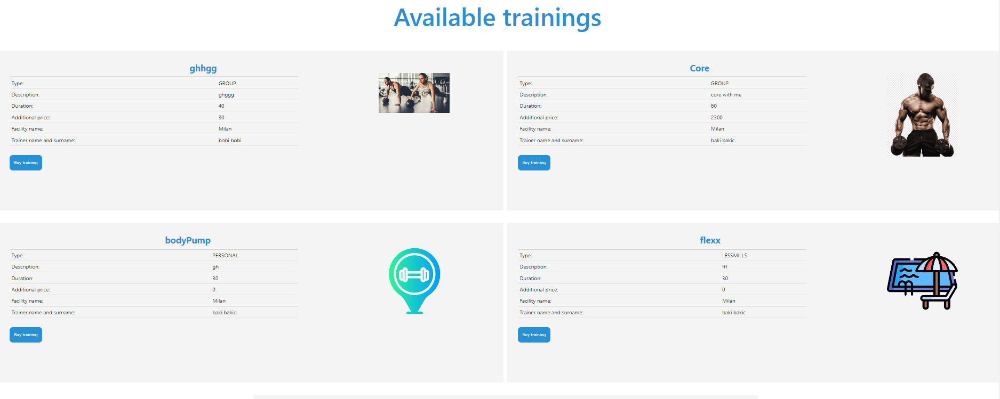
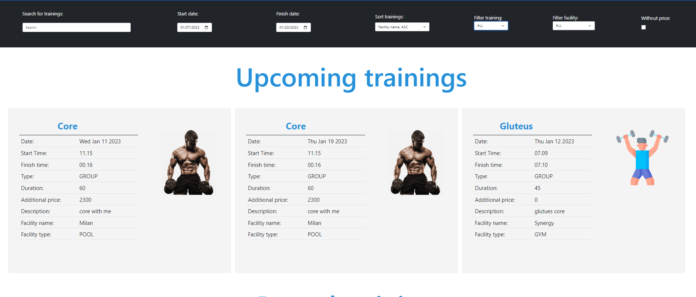
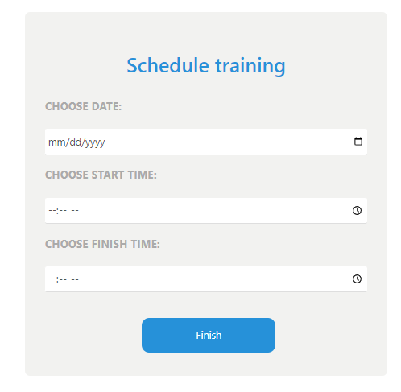
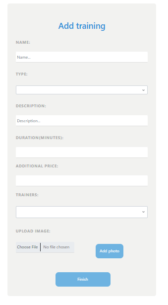

# Fitness Center Management fullstack app

## Overview

This application is a web app for managing fitness centers. The backend is built using Java JAX-RS and the frontend is built using Vue.js. The app has four types of users: admin, customer, manager, and trainer.

## Features

- Admins can create and manage user accounts for customers, managers, and trainers
- Customers can view class schedules, book appointments, and track their fitness progress
- Managers can add and remove classes, schedule appointments, and manage customer information and membership plans
- Trainers can view their schedule and track the progress of their clients
- Users can send notifications and updates to customers through the app
- If you want to see all features run app locally

## Installation and Setup

1. Install JDK 11 or above for java backend.You also have to configure tomcat server(usefull link [https://www.baeldung.com/eclipse-tomcat](https://www.baeldung.com/eclipse-tomcat))
2. Install Node js for vue frontend
3. Clone the repository: `git clone https://github.com/DjordjeVuckovic/body-fit.git`
4. Navigate to the backend project directory: `cd BodyFit` and open project in Eclipse EE
5. Setup previously downloaded and configured tomcat server and run backend
6. The backend base endpoint will be  http://localhost:8080/BodyFit/rest/
7. Navigate to the frontend project directory: `cd vue-router-frontend` and run command: `npm run serve`
8. The frontend will be running on http://localhost:8081

## Built With

- [Java JAX-RS](https://jax-rs.java.net/) - Backend RESTful web service framework
- [Vue.js](https://vuejs.org/) - Frontend JavaScript framework

## Screenshots

